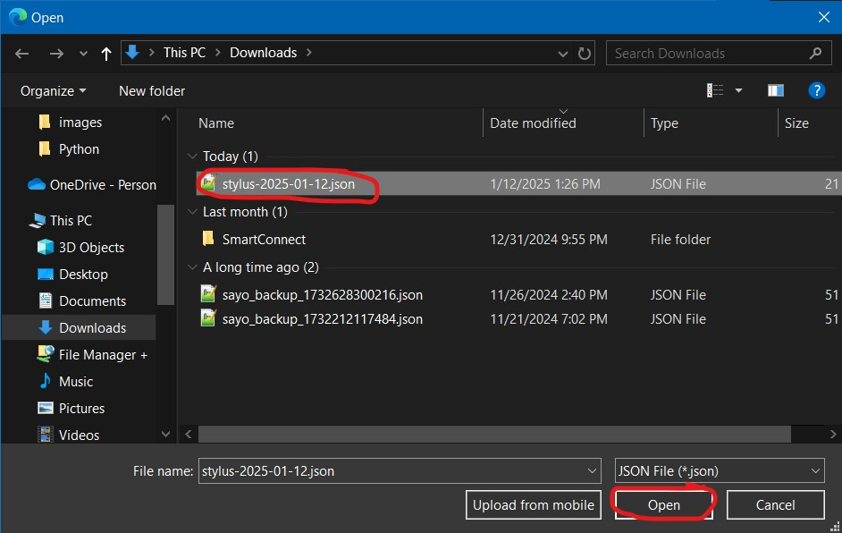

# microbit-mpy-dark-mode
Dark mode implementation for micro:bit MicroPython editor (https://python.microbit.org/).

Please note that I'm not very good at CSS. I was learning it while coding this. The code isn't meant to be very clear or efficient.

# Setup
1. Click on 'stylus.json'
   
    
   
2. Click on 'Download raw file'
   
    
   
3. Go to https://chromewebstore.google.com/ and search for Stylus
   
    

4. Download the Stylus extension
   
    

5. After it installs, click on Extensions button and select Stylus
    
    
   
    

6. Click on 'Manage'
    
    

7. In the new tab that opens, click on 'Import'
    
    

8. Open the JSON file you downloaded in step 2
    
    

9. Go to https://python.microbit.org/ and check if what you see is similar to this:
    
    

10. You can now close the Stylus tab
    
11. You're all set up!
